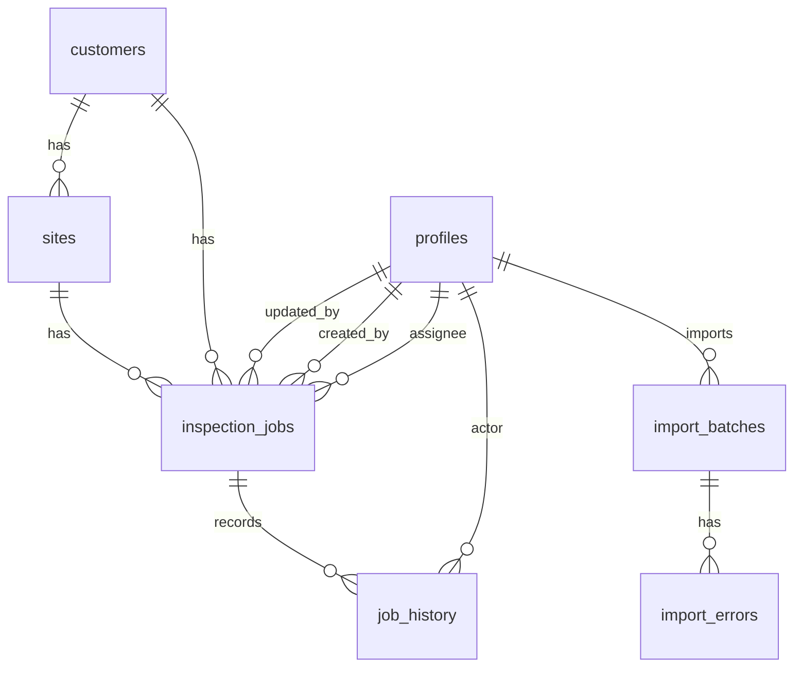

# データベース設計

マイグレーションは `supabase/migrations/202608040001_initial_schema.sql` の1本です。ローカルSupabaseで `db reset` とシードを実行して検証しています。

## テーブル

| テーブル | 主な役割 |
|---|---|
| `profiles` | Supabase Authユーザーに対応する氏名、メール、権限、有効状態 |
| `customers` | 顧客企業 |
| `sites` | 顧客ごとの現場 |
| `inspection_jobs` | 点検案件本体 |
| `job_history` | 案件作成・更新の履歴。CSV取込による作成も `create` として記録 |
| `import_batches` | CSV取込単位と件数サマリ |
| `import_errors` | CSV検証・取込時のエラー明細 |

## ER図

## 主キー・外部キー

- `profiles.id`: `auth.users(id)` を参照
- `customers.id`, `sites.id`, `inspection_jobs.id`, `job_history.id`, `import_batches.id`, `import_errors.id`: UUID、`gen_random_uuid()`
- `sites.customer_id`: `customers.id`
- `inspection_jobs.customer_id`: `customers.id`
- `inspection_jobs.site_id`: `sites.id`
- `inspection_jobs.assignee_id`, `created_by`, `updated_by`: `profiles.id`
- `job_history.job_id`: `inspection_jobs.id`
- `job_history.actor_id`: `profiles.id`
- `import_batches.imported_by`: `profiles.id`
- `import_errors.batch_id`: `import_batches.id`

## 制約

- `profiles.email` は一意
- `customers.customer_code` は一意
- `inspection_jobs.job_no` は一意
- `sites(customer_id, name, address)` は一意
- `inspection_jobs.report_due_date >= inspection_jobs.scheduled_date`
- `inspection_jobs.estimate_amount` はNULLまたは0以上
- `import_batches.total_rows`, `success_rows`, `failed_rows` は0以上
- `import_errors.row_number` は0以上
- 進捗と請求状況はPostgreSQL enumで定義

## インデックス

- `inspection_jobs_assignee_idx`: 担当者別一覧
- `inspection_jobs_status_idx`: 進捗絞り込み
- `inspection_jobs_due_idx`: 提出期限確認
- `inspection_jobs_billing_idx`: 請求状況絞り込み
- `inspection_jobs_customer_idx`: 顧客別参照
- `sites_customer_idx`: 顧客配下の現場参照
- `job_history_job_idx`: 案件別履歴の新しい順取得
- `import_errors_batch_idx`: CSV取込単位のエラー取得

## 関数・トリガー

- `set_updated_at()`: `profiles`, `customers`, `sites`, `inspection_jobs` の更新日時を自動更新
- `log_inspection_job_history()`: `inspection_jobs` のINSERT/UPDATE後に `job_history` を記録
- `current_profile_role()`: 現在のAuthユーザーに紐づく有効プロフィールの権限を返す
- `is_admin()`: admin判定
- `is_staff()`: staff判定

履歴はDBトリガーで登録します。案件作成時は `created_by`、更新時は `updated_by` を `actor_id` として記録し、`changed_fields` には変更対象フィールドごとに `before` と `after` を持つJSONを保存します。

## RLS

全7テーブルでRLSを有効化しています。

| 対象 | admin | staff | viewer |
|---|---|---|---|
| `profiles` | 有効ユーザー閲覧、更新 | 有効ユーザー閲覧 | 有効ユーザー閲覧 |
| `customers` | 閲覧、登録、更新 | 閲覧 | 閲覧 |
| `sites` | 閲覧、登録、更新 | 閲覧 | 閲覧 |
| `inspection_jobs` | 全案件の閲覧、登録、更新 | 自分担当案件の閲覧、更新、自分担当での登録 | 全案件の閲覧のみ |
| `job_history` | 閲覧、可視案件への追加 | 自分担当案件の履歴閲覧、可視案件への追加 | 全案件履歴の閲覧のみ |
| `import_batches` | 閲覧、登録 | 不可 | 不可 |
| `import_errors` | 閲覧、登録 | 不可 | 不可 |

画面上のボタン非表示に加え、Server Action / Route Handler とRLSで権限を確認します。実Supabaseローカル環境では、staffが他人担当案件をID指定SELECTしても0件になること、自分担当案件はSELECTできること、adminとviewerは仕様どおり同じ案件をSELECTできることを統合テストで確認しています。

## GRANT

`public` スキーマのテーブル、ルーチン、シーケンスに対し、`anon`, `authenticated`, `service_role` へ権限を付与しています。実アクセス制御はRLSで行います。
